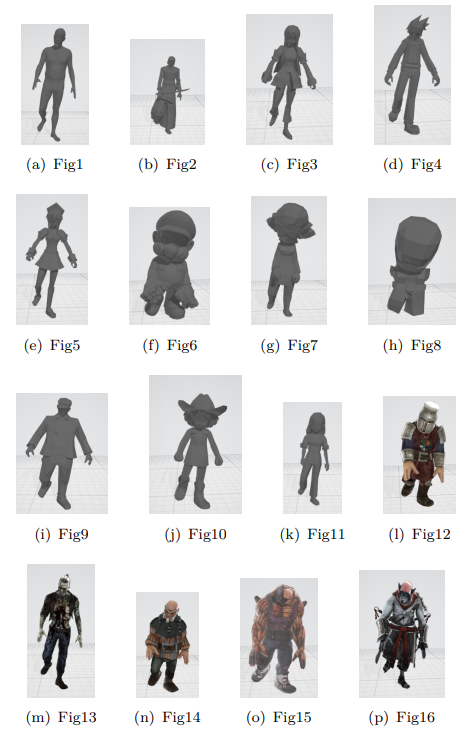

# Pose2Carton 

EE228 课程大作业，利用3D骨架控制3D卡通人物。(https://github.com/yuzhenbo/pose2carton)。  
数据组别：14。 
数据类型：10组匹配+5组蒙皮。 

# Maya 环境配置

在配置环境过程中主要参考了助教提供的知乎教程 https://zhuanlan.zhihu.com/p/367649237
以windows系统下的安装为例，具体来说：  
1、先从maya官网上申请账号，并申请教育版安装资格。  
2、获得教育版权限后正常安装。  
3、添加环境变量，将maya下的bin文件夹所在路径添加到环境变量。  
4、进入cmd并在mayapy中安装pip和numpy即可配置完成。  

# 匹配流程

匹配流程大致如下：  
1、挑选合适的模型，尽量挑选人形模型，这样可以保证它的骨骼结构与人体类似，便于匹配。  
2、先运行transfer.py，程序会打印出印出模型的关键点索引，并根据索引以及SMPL模型进行关键点匹配。  
3、匹配完成后再次运行transfer.py得到3d_sequence。  
4、运行vis.py查看匹配效果，若效果较好则匹配过程结束；否则返回第二部重新匹配。  

# 新增脚本说明

在实验中并未新增脚本。

# 项目结果

这里放置来自你最终匹配结果的截图， 如

# 协议 
本项目在 Apache-2.0 协议下开源

所涉及代码及数据的最终解释权归倪冰冰老师课题组所有

Group xx
